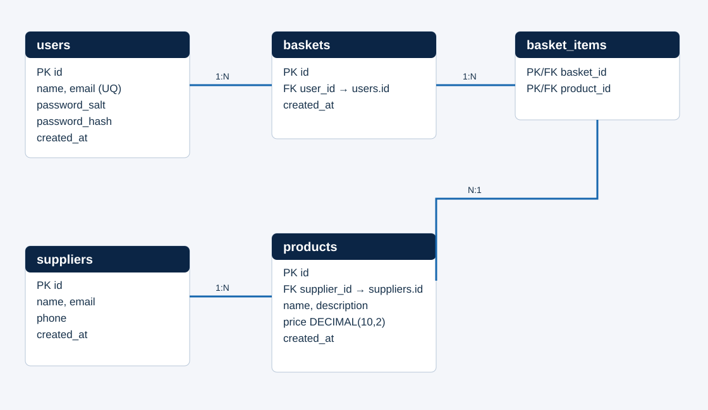

# Mini Sistema de Gestão de Produtos

Aplicação web acadêmica em PHP orientado a objetos, PostgreSQL no Supabase via PDO, HTML, CSS, JavaScript e Bootstrap. Permite cadastro e autenticação de usuários, gestão de fornecedores e produtos e uma cesta com uma unidade por produto.

## Equipe

| Nome | RA |
| --- | --- |
| Preencher | Preencher |

> Substitua os campos acima pelos nomes e RAs de todos os integrantes antes da entrega. Cada integrante deve registrar seus próprios commits.

## Esboços das telas

[Abrir os esboços no Figma](https://www.figma.com/design/mluNZpMTkSifzuvmTFSpxC) — login/cadastro, cadastros, atualização AJAX, seleção de produtos e cesta. A navegação está representada em todas as telas.

## Diagrama Entidade Relacionamento



Relações: um usuário possui várias cestas; uma cesta possui vários itens; cada item aponta para um produto; um fornecedor possui vários produtos. A chave composta `(basket_id, product_id)` impede repetição do mesmo produto na cesta.

## Requisitos

- PHP 8.1 ou superior, com extensões `pdo_pgsql` e `mbstring`.
- Projeto Supabase com banco PostgreSQL.
- Navegador com JavaScript e acesso à CDN do Bootstrap.

## Instalação e execução

1. Crie um projeto em [Supabase](https://supabase.com/dashboard) e anote a senha do banco definida na criação.
2. No painel do projeto, abra **Connect → Session pooler**. Copie host, porta, banco e usuário. O modo de sessão usa a porta `5432` e funciona em redes IPv4.
3. Copie `.env.example` para `.env` e preencha `DB_HOST`, `DB_PORT`, `DB_NAME`, `DB_USER` e `DB_PASSWORD` com os dados do painel. Mantenha `DB_SSLMODE=require`. O arquivo `.env` é ignorado pelo Git; não publique a senha. Variáveis de ambiente do sistema têm prioridade sobre ele.
4. Ative `extension=pdo_pgsql` e `extension=mbstring` no `php.ini`.
5. No terminal, dentro desta pasta, execute `php -S localhost:8000 -t public`.
6. Acesse `http://localhost:8000` e crie uma conta.

Para adicionar dados de demonstração, execute `php scripts/seed.php` dentro da pasta do projeto. O comando insere três fornecedores e nove produtos; se for repetido, não duplica esses exemplos.

O Supabase cria o banco PostgreSQL ao criar o projeto. Na primeira conexão, `Database::connect()` cria automaticamente as cinco tabelas, se não existirem. Não é necessário importar SQL manualmente. O servidor deve apontar para `public`, para que `config.php` e `src` não sejam servidos diretamente.

As tabelas usam nomes em português: `usuarios`, `fornecedores`, `produtos`, `cestas` e `itens_cesta`. Se você estiver atualizando uma instalação antiga que ainda usa nomes em inglês, execute uma vez `php scripts/renomear_tabelas.php` antes de abrir o site; a migração preserva os registros e os relacionamentos.

As tabelas têm Row Level Security (RLS) ativado, sem políticas de acesso pela API pública do Supabase. O backend PHP acessa o PostgreSQL pelo usuário do banco; a autenticação dos usuários do site continua sendo feita pelo próprio PHP.

## Como usar

1. Cadastre um usuário e entre na conta.
2. Em **Cadastros**, inclua fornecedores e produtos vinculados a eles. Essa tela contém apenas formulários de inclusão.
3. Em **Atualização AJAX**, escolha registros existentes para editar ou excluir fornecedores, produtos e itens da cesta. A alteração é enviada sem recarregar a página; a lista é recarregada após a confirmação do servidor.
4. Em **Produtos**, marque ao menos um checkbox e adicione os itens à cesta.
5. Em **Cesta**, confira itens, quantidade e valor total, ou remova itens.

## Regras e segurança

- O enunciado menciona “SHA254”, que não é um algoritmo padronizado. Foi adotado **SHA-256 com salt aleatório por usuário** para atender à intenção do requisito. Para um sistema de produção, recomenda-se `password_hash()` com Argon2id ou bcrypt.
- Senhas nunca são armazenadas em texto puro. A autenticação usa `hash_equals()`; sessões são renovadas no login.
- Todas as alterações passam por token CSRF, validação no servidor e consultas preparadas com PDO.
- Um produto só pode pertencer a um fornecedor existente. Um fornecedor com produtos não pode ser excluído até que seus produtos sejam removidos ou transferidos.
- Não há campo de quantidade. Cada produto aparece no máximo uma vez por cesta.

## Estrutura

```text
config.php           Configuração do MySQL
src/Database.php     Conexão PDO/PostgreSQL e criação automática das tabelas
src/Models.php       Classes User, Supplier, Product e Basket
public/index.php     Rotas, formulários, AJAX e telas
public/app.js        Interações do catálogo e atualização AJAX
views/              Telas separadas de cadastro e atualização
scripts/seed.php     Dados de demonstração
scripts/renomear_tabelas.php  Migração das tabelas antigas para nomes em português
docs/der.svg         DER para consulta no README
```

## Git

O histórico registra etapas de implementação. Antes da entrega, cada integrante deve realizar alterações identificáveis e commits em sua própria conta Git. Publique este repositório no GitHub ou serviço exigido pela disciplina.
